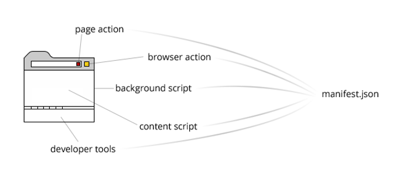
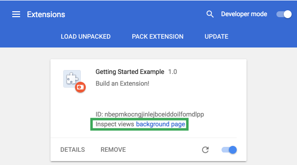
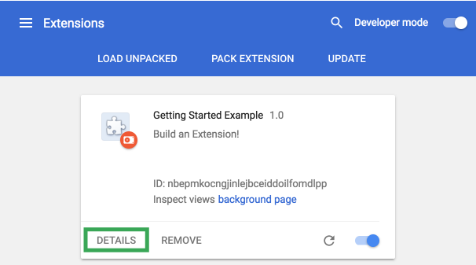

# Учебное пособие по началу работы

>[Оригинал](https://developer.chrome.com/extensions/getstarted)

Расширения состоят из множества разных, но связанных компонентов. Эта совокупность компонентов может состоять
из [фоновых скриптов](https://developer.chrome.com/extensions/background_pages), [контентных скриптов](https://developer.chrome.com/extensions/content_scripts), 
[страницы параметров расширения](https://developer.chrome.com/extensions/options), [UI-элементов](https://developer.chrome.com/extensions/user_interface) и других файлов, реализующих логику. 
Всё это создаются с использованием технологий веб-разработки: HTML, CSS и JavaScript.

В этом руководстве демонстрируется процесс создания расширения, позволяющего пользователю менять цвет фона любой страницы на сайте [developer.chrome.com](http://developer.chrome.com).
В процессе разработки будут задействованы вышеперечисленные осовные компоненты, чтобы дать более наглядное представение об их взаимодействии.

Начните с создания директории для хранения всех файлов расширения ( или загрузите готовый проект [здесь](https://developer.chrome.com/extensions/examples/tutorials/get_started_complete.zip) )


## Манифест

Любое расширение Chrome начинается с [манифеста](https://developer.chrome.com/extensions/extensions/manifest). Cоздайте файл manifest.json и впишите туда следующий код.
(или загрузите файл [здесь](https://developer.chrome.com/extensions/examples/tutorials/get_started/manifest.json))
```json
 {
    "name": "Getting Started Example",
    "version": "1.0",
    "description": "Build an Extension!",
    "manifest_version": 2
 }
```
Уже в текущем состоянии директория проекта, с одним лишь manifest.json, может быть загружена как расширение, но только при активном режиме разработчика.  

1. Откройте менеджер расширений: пройдите по ссылке [chrome://extensions](chrome://extensions) в вашем браузере. 
	- Вы также можете попасть на эту страницу, кликнув в верхнем правом углу на меню Chrome, в открывшемся списке выберите пункт **Дополнительные параметры**, далее - **Расширения**.
2. Установите флажок в состояние **«Режим разработчика»**.
3. Нажмите на кнопку **«Загрузить распакованное расширение»** и укажите директорию, в которой находится ваше расширение.


Та-да! Расширение успешно установлено! Поскольку информация о «значке» не прописана в манифесте, для расширения сгенерировалась своя иконка панели инструментов.


## Новые инструкции

Расширение была установлено, но оно ничего не делает.
Добавьте фоновый скрипт: создайте файл background.js (или загрузите его [здесь](https://developer.chrome.com/extensions/examples/tutorials/get_started/background.js))

Фоновый скрипт и многие другие важные компоненты должны быть зарегистрированы в манифесте. Регистрация в манифесте указыват расширению на какой файл ссылаться и 
как он должен себя вести(его роль). Добавьте следующие инструкции в manifest.json:
```json
  {
    "name": "Getting Started Example",
    "version": "1.0",
    "description": "Build an Extension!",
    "background": {
      "scripts": ["background.js"],
      "persistent": false
    },
    "manifest_version": 2
  }

```
добавить обзор: ? поле background - поведение, scripts - ссылка и "persistent?
обязательное объяснение непостоянства persistent


Теперь расширение осведомлено, что оно содержит непостоянный фоновый скрипт. Оно просканирует/просмотрит/проанализирует зарегестрированный файл для обнаружения важных событий,
которые необходимо слушать. или просто на обнаружение обработчиков событий??

Сразу после установки это расширение запросит информацию из некой постоянной переменной. 
и тут как бы мы эту логику реализуем 
Начните с добавления обработчика(прослушки) события «runtime.onInstalled» в фоновый скрипт. 
Внутри обработчика события будет реализован функционал, который будет этой самой некой постоянной переменной присваивать значение, с использованием API storage. это переписать.
Это позволит(то что в storage api) нескольким компонентам расширения иметь доступ к этому значению и обновлять его.

```javascript
chrome.runtime.onInstalled.addListener(function() {
    chrome.storage.sync.set({color: '#3aa757'}, function() {
      console.log("The color is green.");
    });
  });
```

Большинство API-интерфейсов, включая storage API, могут ипользоваться только если были зарегистрированы в поле «Permissions».

```json
{
    "name": "Getting Started Example",
    "version": "1.0",
    "description": "Build an Extension!",
    "permissions": ["storage"],
    "background": {
      "scripts": ["background.js"],
      "persistent": false
    },
    "manifest_version": 2
}
```

Вернитесь на страницу менеджера расширений и нажмите на кнопку **Reload**. Стало доступно новое поле **Inspect views** со значением:
**background page**. 


Кликните на ссылку **background page**, в открывшейся консоли вы увидите:  «The color is green.».

## Введение в UI
Пользовательский интерфейс может выглядеть по-разному, в данном примере будет использовано всплывающее окно.
Создайте файл popup.html в директории расширения или загрузите его [отсюда](https://developer.chrome.com/extensions/examples/tutorials/get_started/popup.html).
В примере реализуется функционал: при нажатии на кнопку меняется цвет фона.

```
{
     <!DOCTYPE html>
  <html>
    <head>
      <style>
        button {
          height: 30px;
          width: 30px;
          outline: none;
        }
      </style>
    </head>
    <body>
      <button id="changeColor"></button>
    </body>
  </html>
}
```
Подобно фоновому сценарию, этот файл должен быть определён как всплывающее окно в поле page_action.

```json
{
    "name": "Getting Started Example",
    "version": "1.0",
    "description": "Build an Extension!",
    "permissions": ["storage"],
    "background": {
      "scripts": ["background.js"],
      "persistent": false
    },
    "page_action": {
      "default_popup": "popup.html",
    },
    "manifest_version": 2
  }
```
Иконки для панели инструментов также определяются в поле page_action. Загрузите папку с изображениями 
отсюда и разархивируйте в директорию расширения. Обновите manifest.json, чтобы осведомить расширение, как использовать изображения.

```json
  {
    "name": "Getting Started Example",
    "version": "1.0",
    "description": "Build an Extension!",
    "permissions": ["storage"],
    "background": {
      "scripts": ["background.js"],
      "persistent": false
    },
    "page_action": {
      "default_popup": "popup.html",
      "default_icon": {
        "16": "images/get_started16.png",
        "32": "images/get_started32.png",
        "48": "images/get_started48.png",
        "128": "images/get_started128.png"
      }
    },
    "manifest_version": 2
  }
```
Иконки также можно отобразить в менеджере расширений. Определите их в поле icons:
```json
 {
    "name": "Getting Started Example",
    "version": "1.0",
    "description": "Build an Extension!",
    "permissions": ["storage"],
    "background": {
      "scripts": ["background.js"],
      "persistent": false
    },
    "page_action": {
      "default_popup": "popup.html",
      "default_icon": {
        "16": "images/get_started16.png",
        "32": "images/get_started32.png",
        "48": "images/get_started48.png",
        "128": "images/get_started128.png"
      }
    },
    "icons": {
      "16": "images/get_started16.png",
      "32": "images/get_started32.png",
      "48": "images/get_started48.png",
      "128": "images/get_started128.png"
    },
    "manifest_version": 2
  }
```

Если на данном этапе обновить расширение в менеджере, то оно будет отображаться в виде иконки серого цвета на
панели инструментов, что характеризует недоступность UI. Необходимо сделать так, чтобы расширение могло сообщать браузеру, когда пользователь
может взаимодействовать с popup.html. 

В файле background.json, внутри функции, обрабатывающей событие runtime.onInstalled запишите/добавьте задекларарованное правило с использованием declarativeContent API.
декларативное правило включает в себя условие и действие, оно пр-сути позволяет изменять уже существующее событие(скорее даже его испускатель) и сразу назначать ему действие, т.е хандлер.

```javascript
chrome.runtime.onInstalled.addListener(function() {
    chrome.storage.sync.set({color: '#3aa757'}, function() {
      console.log('The color is green.');
    });
    chrome.declarativeContent.onPageChanged.removeRules(undefined, function() {
      chrome.declarativeContent.onPageChanged.addRules([{
        conditions: [new chrome.declarativeContent.PageStateMatcher({
          pageUrl: {hostEquals: 'developer.chrome.com'},
        })
        ],
            actions: [new chrome.declarativeContent.ShowPageAction()]
      }]);
    });
  });
```
//removeRules с параметром undefined удаляет все правила испускателя onPageChanged, addRules добавляет новое правило
// condition - массив условий, в данном случае из готового списка условий PageStateMaster берём hostEquals:
// Выполняется, если имя хоста URL-адреса соответствует указанной строке. (конечно это не просто уловия, а объект со сложной логикой)
// actions - массив действий, ShowPageAction() - название говорит за себя - отобразить page action контент - т.е иконеу и Popup;

И снова в манифесте предоставьте расширению доступ к API declarativeContent:
```json
 {
    "name": "Getting Started Example",
  ...
    "permissions": ["declarativeContent", "storage"],
  ...
  }
```
Теперь, когда пользователи перейдут по URL-адресу, содержащему «developer.chrome.com», браузер на панели инструментов отобразит иконку в цвете, кроме того
щелчёк по ней откроет popup.html.


Доработайте всплывающее окно так, чтобы кнопка прибоела цвет. Создайте файл popup.js в директории расширения и впишите в него следующий код (или просто
скачайте [здесь](https://developer.chrome.com/extensions/examples/tutorials/get_started/popup.js)):
```javascript
 let changeColor = document.getElementById('changeColor');

  chrome.storage.sync.get('color', function(data) {
    changeColor.style.backgroundColor = data.color;
    changeColor.setAttribute('value', data.color);
  });
```

Этот код из DOM-дерева popup.html получает объект кнопки и запрашивает значение цвета из хранилища.  
Затем он задает цвет фону кнопки. Включите следующий тег script в popup.html, он подключит popup.js.


```html
<!DOCTYPE html>
<html>
...
  <body>
    <button id="changeColor"></button>
    <script src="popup.js"></script>
  </body>
</html>
```

Перезагрузите расширение, чтобы кнопка стала зеленой.

## Логика взаимодействия

Итак, расширение предоставляет доступ к UI, только если пользователь перешёл на сайт developer.chrome.com, также оно
отображает зелёную кнопку, но всё ещё нуждается в логике взаимодействия с пользователем. Добавьте в popup.js следующий код:
```javascript
let changeColor = document.getElementById('changeColor');
  ...
  changeColor.onclick = function(element) {
    let color = element.target.value;
    chrome.tabs.query({active: true, currentWindow: true}, function(tabs) {
      chrome.tabs.executeScript(
          tabs[0].id,
          {code: 'document.body.style.backgroundColor = "' + color + '";'});
    });
  };
```
//activeTab API(разновидность contentscript) даёт временный доступ к текущей активной вкладке, когда пользователь обращается к расширению.
//позволяет executeScipt/ insertCSS, получпть доступ к url, иконке, title
//концепции diclaratively и programatically inject по всей видимости реализованы из потребности к безопасности, чтобы невесть что не делали, изучай

Этот код добавляет обработчик события клика по кнопке, он запускает programatically injected content script. 
Который в свою очередь меняет цвет фона страницы на тот, который содержится в объекте кнопки.
Реализуйте programatically injection для функционала обращении пользователей к контентным скриптам , вместо автоматической вставки нежелательного кода в веб-страницу.

Добавьте в manifest в поле permission значение activeTab, это даст временный доступ расширению к tabs API.
```json
  {
    "name": "Getting Started Example",
  ...
    "permissions": ["activeTab", "declarativeContent", "storage"],
  ...
  }
```

На данный момент расширение реализует весь задуманный функционал! Перезагрузите расширение, обновите эту страницу, откройте всплывающее окно и
кликните на кнопку: ДА БУДЕТ ЦВЕТ!


## Параметры расширения

На данный момент расширение позволяеть только менять цвет фона на зеленый. Добавьте страницу параметров, которая даст пользователям больше 
контроля над функционалом расширения, а также позволит настроить под себя.

Начните с создания файла options.html в корневой директории и впишите в него следующий код (а также можете скачать его [здесь](https://developer.chrome.com/extensions/examples/tutorials/get_started/options.html).)
```html
  <!DOCTYPE html>
  <html>
    <head>
      <style>
        button {
          height: 30px;
          width: 30px;
          outline: none;
          margin: 10px;
        }
      </style>
    </head>
    <body>
      <div id="buttonDiv">
      </div>
      <div>
        <p>Choose a different background color!</p>
      </div>
    </body>
    <script src="options.js"></script>
  </html>
```
Зарегистрируйте страницу параметров в манифесте.
```json
  {
    "name": "Getting Started Example",
    ...
    "options_page": "options.html",
    ...
    "manifest_version": 2
  }
```
Перезагрузите расширение и кликните на DETAILS.

;

Прокрутите страницу вниз и выберите Extenaion options чтобы открылась страница параметров, хотя сейчас она пуста.

;

Следущий шаг - реализация логики страницу параметров. Создайте файл options.js в корневой директории со следующим кодом.
(или просто скачайте [здесь](https://developer.chrome.com/extensions/examples/tutorials/get_started/options.js)):

```javascript
   let page = document.getElementById('buttonDiv');
  const kButtonColors = ['#3aa757', '#e8453c', '#f9bb2d', '#4688f1'];
  function constructOptions(kButtonColors) {
    for (let item of kButtonColors) {
      let button = document.createElement('button');
      button.style.backgroundColor = item;
      button.addEventListener('click', function() {
        chrome.storage.sync.set({color: item}, function() {
          console.log('color is ' + item);
        })
      });
      page.appendChild(button);
    }
  }
  constructOptions(kButtonColors);
```
Предусмотрено четыре варианта цвета, которые генерируются на странице параметров
в виде кнопок с обработчиками событий на нажатие. Когда пользователь нажимает на кнопку, 
значение цвета в глобальной хранилище обновляется. Поскольку все файлы расширения извлекают информацию о цвете из глобального хранилища, 
никакие другие значения не нуждаются в обновлении.


### Сделайте следующий шаг

Поздравляем, на данный момент ваша директория содержит полноценное расширение для Chrome

Что дальше?

* Обзор