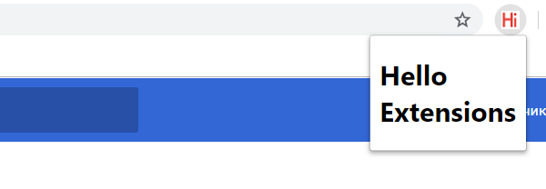

# Что такое расширения?

>Перевод руководства "Extend the Browser" от 06.12.2018

>[Оригинал](https://developer.chrome.com/extensions)

>Вообще для чего этот Elementary-level перевод? - Для себя, чтобы разобраться с расширениями и в дальнейшем обращаться к этой статье.


Расширения - это небольшие компьютерные программы, которые реализуются на основе веб-технологий, таких как HTML, CSS и Javascript. Они позволяют расширить функциональные возможности 
браузера. С их помощью пользователи настраивают Chrome под индивидуальные потребности. 

Расширение должно выполнять [одну конкретную и узко определенную задачу](https://developer.chrome.com/extensions/single_purpose). Конечно оно может включать в себя несколько компонентов и целый
ряд функциональных возможностей, если все они способствуют выполнению общей задачи.

Пользовательский интерфейс должен быть минималистичным и понятными. Он может представлять из себя все что угодно: от простого значка, например как [расширение Google Mail Checker](https://chrome.google.com/webstore/detail/google-mail-checker/mihcahmgecmbnbcchbopgniflfhgnkff?hl=ru) (на рис. ниже),
до [HTML элемента, перекрывающего всю страницу](http://github.com).


Файлы расширения упакованы в **.crx** архив, который загружается и устанавливается пользователем. Это значит, что расширения не зависят от какого-либо удаленного контента, в отличие от обычных
веб-приложений. 

Расширения распространяются через панель инструментов разработчика - [Chrome Developer Dashboard](https://chrome.google.com/webstore/developer/dashboard) и публикуются
в [Интернет-магазине Chrome](https://chrome.google.com/webstore/category/extensions). Для получения подробной информации см. документацию - [store developer documentation](http://code.google.com/chrome/webstore).
 
## Первое знакомство с расширениями

C помощью этого краткого примера «Hello Extension», сделайте первый шаг в мир расширений.
Начните с создания директории для хранения всех файлов расширения ( или загрузите готовый проект [здесь](https://developer.chrome.com/extensions/samples#search:hello) )

Затем, создайте файл manifest.json и впишите туда следующий код:

```json
  {
    "name": "Hello Extensions",
    "description" : "Base Level Extension",
    "version": "1.0",
    "manifest_version": 2
  }
```
Манифест - обязательный файл для любого расширения в JSON-формате. В нём указаны все названия, описания и ресурсы расширения. 
В данном примере, расширение реализуется с помощью двух сущностей - значка и всплывающего окна. Добавьте эту информацию в код,
записав инструкции в поле [browser_action](https://developer.chrome.com/browserAction): 

 ```json
   {
    "name": "Hello Extensions",
    "description" : "Base Level Extension",
    "version": "1.0",
    "manifest_version": 2,
    "browser_action": {
      "default_popup": "hello.html",
      "default_icon": "hello_extensions.png"
    }
  }
```
Скачайте [hello_extensions.png здесь](https://developer.chrome.com/static/images/index/hello_extensions.png) и затем создайте файл **hello.html** с кодом:

```html
	<html>
		<body>
		  <h1>Hello Extensions</h1>
		</body>
	</html>
```
Итак, теперь когда значок кликнут, на экране отображается **hello.html**. Следующий шаг - это запись инструкций для команд в manifest.json, которые позволит использовать
сочетания клавиш для определенных действий. Это забавный, но необязательный шаг:
 ```json
  {
    "name": "Hello Extensions",
    "description" : "Base Level Extension",
    "version": "1.0",
    "manifest_version": 2,
    "browser_action": {
      "default_popup": "hello.html",
      "default_icon": "hello_extensions.png"
    },
    "commands": {
      "_execute_browser_action": {
        "suggested_key": {
          "default": "Ctrl+Shift+F",
          "mac": "MacCtrl+Shift+F"
        },
        "description": "Opens hello.html"
      }
    }
  
  }
```
 Следующий шаг - установка расширения локально в браузер. 
1. Перейдите по ссылке [chrome://extensions](chrome://extensions) в вашем браузере. Вы также можете попасть на эту страницу, кликнув в верхнем правом углу на меню Chrome,
в открывшемся списке выберите пункт **Дополнительные параметры**, далее - **Расширения**.
2. Установите флажок в состояние «Режим разработчика».
3. Нажмите на кнопку «Загрузить распакованное расширение» и укажите директорию, в которой находится расширение «Hello Extensions».

Поздравляем! Теперь вы можете использовать расширение на основе всплывающего окна, щелкнув значок hello_world.png или нажав Ctrl + Shift + F на клавиатуре.
 

 
### Что дальше?
 Следуйте к мануалу: [Руководство по началу работы](https://github.com/diehardkamikaze/study/blob/master/Optional/Chrome%20Extensions%20Tutorial/Get%20Started%20Tutorial/README.md)
 
 
 
 
 
 
