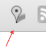
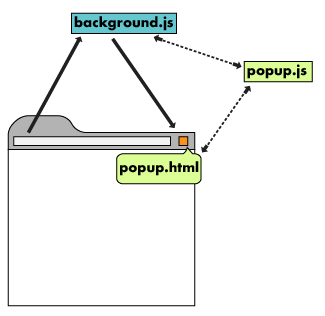
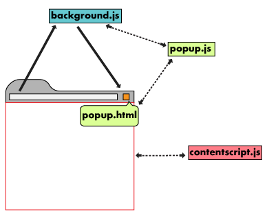

# Обзор

Расширение - это архив HTML, CSS, JS файлов, изображений и т.д, который позволяет настраивать Google
Chrome под индивидуальные потребности пользователя. Расширения создаются на основе веб-технологий и могут использовать те же API-интерфейсы, 
которые браузер предоставляет для веб-приложений.


Расширения имеют целый ряд функциональных возможностей. Они могут изменять контент веб-страниц, взаимодействовать с ним или расширять его, 
а также изменять поведение самого браузера.

Рассмотрим возожности расширений, которые в наибольшей степени позволяют персонализировать браузер Chrome.

## Файлы расширений

Расширения различаются типом файлов, количеством директорий, однако все они должны содержать манифест.
Некоторые базовые, но полезные расширения могут состоять только из манифеста и иконки на панели инструментов.

```json
{
    "name": "My Extension",
    "version": "2.1",
    "description": "Gets information from Google.",
    "icons": {
      "128": "icon_16.png",
      "128": "icon_32.png",
      "128": "icon_48.png",
      "128": "icon_128.png"
    },
    "background": {
      "persistent": false,
      "scripts": ["background_script.js"]
    },
    "permissions": ["https://*.google.com/", "activeTab"],
    "browser_action": {
      "default_icon": "icon_16.png",
      "default_popup": "popup.html"
    }
  }
```
Расширения должны иметь иконку, которая располагается на панели инструментов браузера. Поскольку она информирует пользователя об установленных расширениях.
К тому же большинство пользователей будет взаимодействовать с расширением посредством клика на иконку. 

 | 
------------ | -------------
Google Mail Checker использует browser action | Mappy использует page content API и контентные скрипты. 


### Ссылки на файлы

Указывать ссылки на файлы расширений можно с помощью относительных URL-адресов, точно также как это делается на HTML-страницах.

```html
  
```
Кроме того, к каждому файлу можно получить доступ с помощью абсолютного URL.

> chrome-extension://<extensionID>/<pathToFile>

<extensionID> - это уникальный идентификатор, который система генерирует для каждого расширения. Его можно увидеть, 
перейдя по адресу chrome://extensions. <PathToFile> - это расположение файла относительно корневой директории.
(таким образом - получаем абсолютный путь, прямо как и у сайтов в вебе)

Во время работы с распакованным расширением идентификатор может измениться. В частности, идентификатор меняется, 
если расширение будет загружено из другого каталога; ID снова может измениться при архивировании.
Поэтому если вы планируете использовать в коде абсолютные URL, то лучше получайте их с помощью метода chrome.runtime.getURL(), 
это позволит избежать массу неприятностей, связанной с изменением ID.

## Архитектура

Архитектура расширения в первую очередь будет зависить от функций, которое оно должно выполнять. Однако сложные/серъёзные
расширения (обязательно) будут состоять из следующих компонентов:

* Manifest
* Background скрипт
* Content скрипт
* UI
* Страница параметров

### Background скрипт
Фоновый скрипт нужен для обработки событий расширения; Он слушает важные события, генерируемые браузером. 
Он находится в состоянии покоя, пока событие не сработает, а затем выполняет заданную логику.
Эффективный фоновый скрипт загружается только тогда, когда он необходим, и выгружается, когда возникает простой.
### UI
Пользовательский интерфейс расширения должен быть интуитивно-понятным и минималистичным. UI должен персонализировать или совершенствовать
работу с браузером, а не отвлекать от неё(не ухудшать её). Большинство UI построено на page action или browser action API, но доступны
и другие формы: context menu, omnibox API, keyboard shortcuts API.   

Страницы UI, такие как popup, могут состоять из обычных HTML-страниц, с логикой на Javascript.
Расширения также могут вызывать tabs.create или window.open() для отображения дополнительных файлов HTML, присутствующих в расширении. 

Расширения, использующие popup и page action API с помощью declarative content API могут назначить правила в фоновый скрипт, которое будет контролировать доступ к popup.
Когда условия правила будут выполнены, фоновый скрипт взаимодействует с popup, чтобы сделать его кликабельным для пользователей.


### Content скрипт
Расширения, которые считывают или записывают информацию с веб-страницы используют content script. Content script содержит Javascript, который
выполняется в контексте загруженной веб-страницы. Content script позволяет считывать и изменять DOM веб-страницы.  



Content scripts могут взаимодействовать со своим родительским расширением, обмениваясь сообщениями и сохраняя значения с помощью storage API.


### Страница параметров

Так же как расширения персонализируют браузер, страница параметров перонализирует само расширение. Парпаметры могут быть нужны для
изменения каких-либо свойств, позволяют пользователю выбрать нужный ему функционал.


## Работа с Chrome APi

Расширениям доступен тот же API, который используют веб-страницы. Однако существуют extension-specific APIs, которые обеспечивают
тесную интеграцию с бразуером. Как расширения, так и веб-страницы могут обратиться к стандартному методу window.open(URL) для открытия нового окна с указанным URL, 
но только расширения могут уточнить, в каком окне должен отобразиться URL ?????( не ясно, речь идёт current.window or new tab походу) с помощью метода tabs.create() (замены на него) из Chrome API.

### Асинхронные методы против сихнронных
нет конечных знаний и опыта по асинхронности на данный момент, чтобы полностью понимать.
Большинство методов Chrome API асинхронны: после выполнения, они мгновенно возвращает значение не дожидаясь завершения текущей операции(как бы врывается в код в любой момент??)


```javascript
  //ЭТОТ КОД НЕ РАБОТАЕТ
  var tab = chrome.tabs.query({'active': true}); //WRONG!!!
  chrome.tabs.update(tab.id, {url:newUrl});
  someOtherFunction();
```

```javascript
// Signature for an asynchronous method
  chrome.tabs.query(object queryInfo, function callback)
```


```javascript
    //А ЭТОТ КОД РАБОТАЕТ
  chrome.tabs.query({'active': true}, function(tabs) {
    chrome.tabs.update(tabs[0].id, {url: newUrl});
  });
  someOtherFunction();
```


```javascript
  // Synchronous methods have no callback option and returns a type of string
  string chrome.runtime.getURL()
```


### Подробнее

Для получения дополнительной информации изучите справочные документы по Chrome API и посмотрите следующее видео.

ТУТВИДЕО

## Связь(Взаимодействие) между страницами

Различные компоненты расширения часто должны связываться друг с другом. Разные HTML-страницы могут найти друг друга с помощью методов [chrome.extension](), таких как getViews() и getBackgroundPage().
Когда страница получает ссылку на другую страницу расширения, она может обращаться к функциям этой страницы и манипулировать с её DOM. А ещё всё компоненты расширения имеют доступ к значениям сохраненний в storage(благодаря storage API)
и обмениваться данными через [передачу сообщений](https://developer.chrome.com/extensions/messaging).


## Сохранение данных и режим инкогнито

Расширения могут сохранять данные с помощью [storage API](), [web storage API]() - хранилище в HTML5, или с помощью запросов на сервер, результатом которых будет сохранение данных
(где-нибудь в бд). Когда расширение должно что-то сохранять, первое о чём следует подумать - это что-то не из инкогнито-окна?  По умолчанию расширения отключены в режиме инкогнито(но можно включить - 
Разрешить использование в режиме инкогнито в настройках расширения).

Режим инкогнито гарантирует, что сведения из окна не будут отслеживаться, сохраняться. При работе с данными из инкогнито-окон, расширение должны выполнять это обещание.
Если расширение обычно сохраняет историю просмотров, в режиме инкогнито оно этого делать не должно. Тем не менее, расширения могут хранить настройки параметров любого окна, инкогнито оно или нет.

Чтобы отследить находится ли окно в режиме инкогнито, проверьте свойство incognito соответствующих объектов [tabs.Tab]() или [windows.Window]().

```javascript
  function saveTabData(tab) {
  if (tab.incognito) {
    return;
  } else {
    chrome.storage.local.set({data: tab.url});
  }
}
```


## Следующий шаг

Полностью освоив  [обзорную статью]() и её составляющие, а также завершив [Руководство по началу работы](), разработчик может начать разработку своих собственных расширений Chrome!
Погрузитесь глубже в мир Chrome могут помочь следующие ресурсы:
* Узнайте о возможностях отладки расширений в [руководстве по отладке]().
* Расширения Chrome имеют доступ к мощным API, сверх тех, что доступны для Веба. [Документация Сhrome.* APIs]() повествует о каждом API.
* [Руководство разработчика]() содержит десятки дополнительных ссылок на фрагменты документации о продвинутой разработке расширений.
